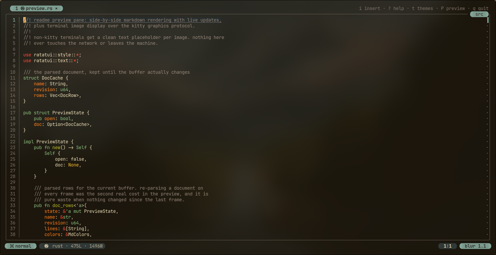
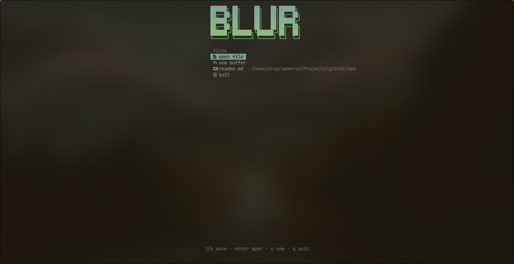
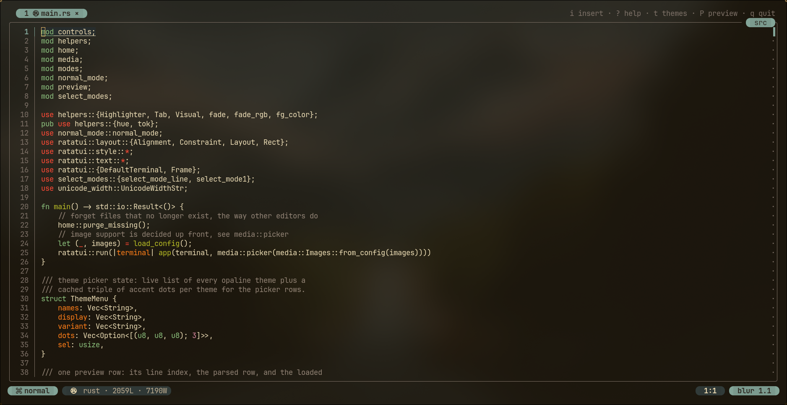
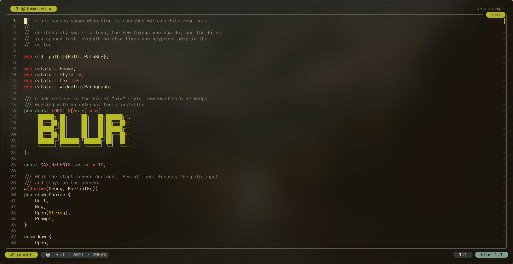
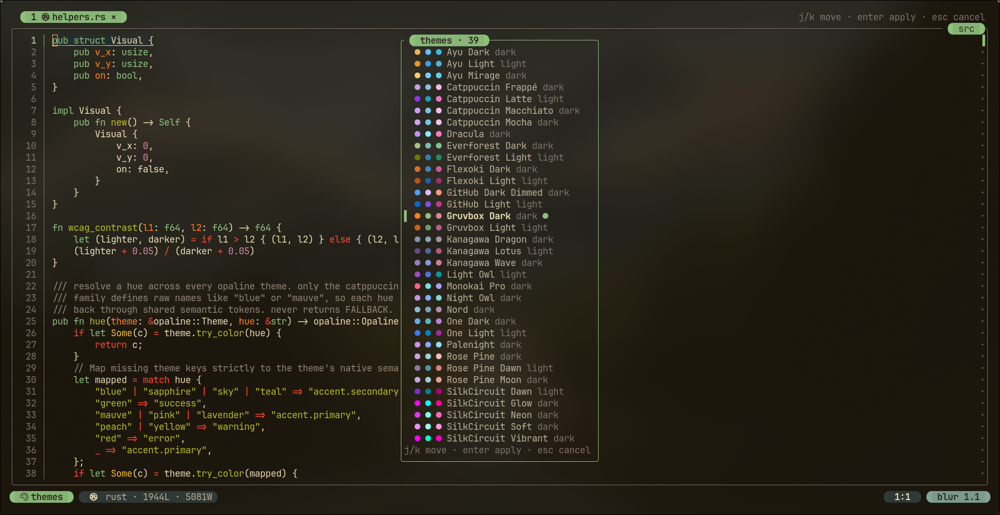
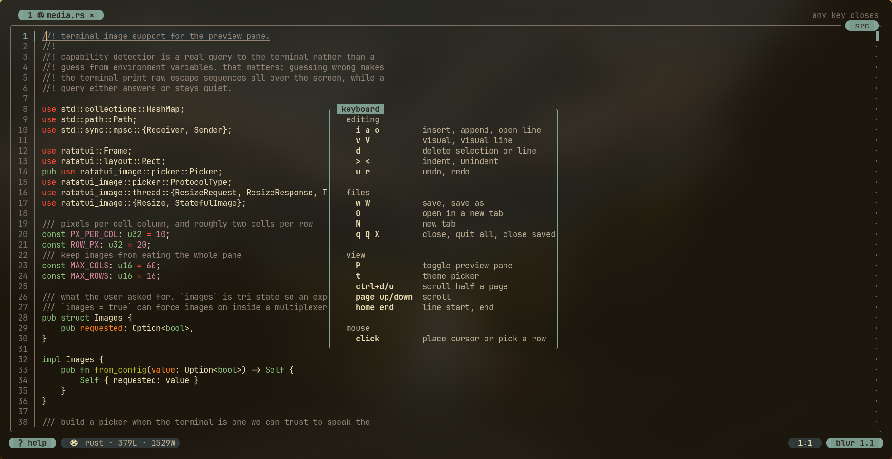
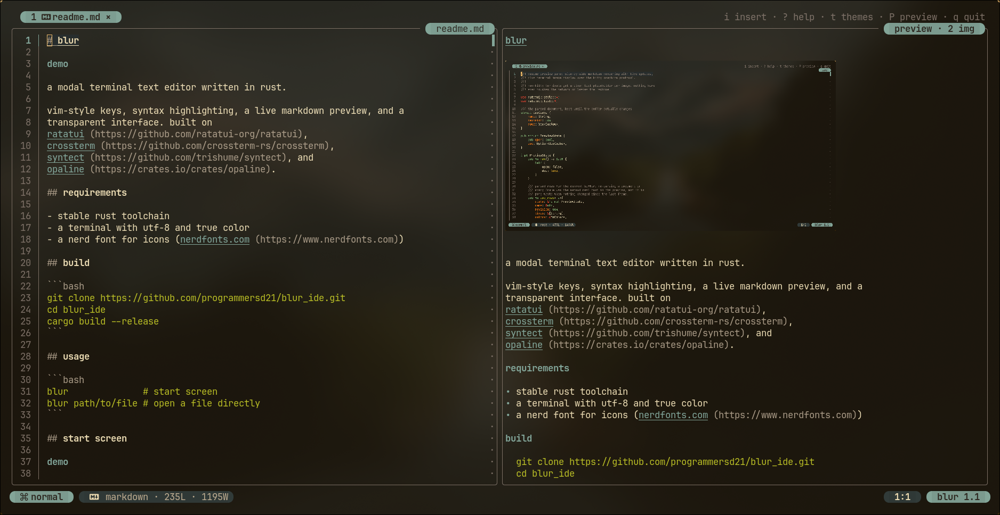

# blur



[](https://github.com/castlesp5/blur/stargazers)
[](https://github.com/castlesp5/blur/network/members)
[](https://www.rust-lang.org/)
[](https://ratatui.rs/)

a modal terminal text editor written in rust.

vim-style keys, syntax highlighting, a live markdown preview, and a
transparent interface. built on
[ratatui](https://github.com/ratatui-org/ratatui),
[crossterm](https://github.com/crossterm-rs/crossterm),
[syntect](https://github.com/trishume/syntect), and
[opaline](https://crates.io/crates/opaline).

## requirements

- stable rust toolchain
- a terminal with utf-8 and true color
- a nerd font for icons ([nerdfonts.com](https://www.nerdfonts.com))

## build

```bash
git clone https://github.com/programmersd21/blur_ide.git
cd blur_ide
cargo build --release
```

## usage

```bash
blur              # start screen
blur path/to/file # open a file directly
```

## start screen



launched with no arguments, blur opens on a start screen: the logo,
`open file`, `new buffer`, `quit`, and the files you opened last.

| keys | action |
| ---- | ------ |
| `j` / `k`, arrows | move |
| `enter` | open the highlighted entry, or confirm the path |
| `o` | focus the path prompt |
| paste | paste a path straight in |
| any character | start typing a path |
| `n` | new buffer |
| `q` / `esc` | quit |
| click | activate an entry |

the cursor is hidden on the start screen and only appears while a path
is being typed. in normal mode, `h` comes back here without closing any
open tabs.

closing the last tab also brings you here, so quitting is always a
deliberate choice made from the start screen rather than something you
fall into.

recents live in `$XDG_STATE_HOME/blur/recent`, or `$BLUR_STATE_DIR/recent`
when that is set. entries that are deleted, are not files, or resolve to
the same file twice are dropped at startup.

## normal mode



| keys | action |
| ---- | ------ |
| `h j k l`, arrows | move cursor |
| `g` / `G` | first line / last line |
| `e` / `b` | word forward / back |
| `E` / `B` | end / start of line |
| `i` / `a` / `o` | insert, append, open line below |
| `J` / `K` | move line down / up |
| `>` / `<` | indent / unindent line |
| `d` | delete line |
| `u` / `r` | undo / redo |
| `v` / `V` | visual / visual-line mode |
| `w` / `W` | save / save as |
| `O` | open file in a new tab |
| `N` | new tab |
| `Tab` / `Shift+Tab` | next / previous tab |
| `?` | keyboard help |
| `t` | theme picker |
| `P` | toggle preview pane |
| `X` | close all saved tabs |
| `q` | close tab, or go to the start screen if it was the last one |
| `Q` | quit everything |

## insert mode



| keys | action |
| ---- | ------ |
| text | insert at cursor |
| `enter` | split line, carrying indentation |
| `tab` / `shift+tab` | indent / unindent |
| `}` `)` `]` | dedent when on blank indentation |
| `backspace` | delete before cursor, or merge lines |
| `delete` | delete under cursor, or remove empty line |
| `esc` | back to normal mode |

## scrolling

| keys | action |
| ---- | ------ |
| wheel | scroll, the cursor rides along |
| `shift` + wheel | scroll sideways |
| `page down` / `page up` | half page |
| `ctrl+d` / `ctrl+u` | half page |
| `ctrl+f` / `ctrl+b` | full page |
| `home` / `end` | start / end of line |

scrolling moves the window and the cursor together, so the view never
snaps back to the cursor.

## theme picker



`j` / `k` or arrows move with live preview, `enter` keeps the theme, `esc`
restores the previous one. each row shows three accent dots sampled from
the theme.

## other prompts

| keys | action |
| ---- | ------ |
| `enter` | confirm a save or open path |
| `esc` | cancel |
| any key | close the help sheet |

a failed save or open keeps the buffer and the typed path, so a retry
costs nothing.

## help



press `?` in normal mode for a sheet covering editing, files, view, and
mouse. any key closes it.

## mouse

- click to place the cursor, drag to select
- click a tab to switch, click its `×` or middle-click it to close
- click a theme row to apply
- click the left half of the confirm dialog to quit
- wheel or trackpad scroll, with the cursor riding along

## configuration

`$XDG_CONFIG_HOME/blur/config.toml`:

```toml
theme = "catppuccin-mocha"
images = true
home_on_close = true
```

every key is optional.

| key | default | meaning |
| --- | ------- | ------- |
| `theme` | `catppuccin-mocha` | name of a bundled theme |
| `images` | unset | terminal image support, see the preview section |
| `home_on_close` | `true` | closing the last tab returns to the start screen instead of quitting |

## markdown 



press `P` with a markdown file open. the preview re-renders on every edit
and scrolls with the editor. headings, lists, quotes, code, and links
render in theme colors.

images display through the kitty graphics protocol on kitty, wezterm,
and ghostty. detection reads environment signals rather than querying the
terminal, because the query protocol leaves a background reader on stdin
when a terminal does not answer, which swallows keystrokes.

other terminals get a clean `[alt] path` placeholder instead of raw
escape codes. set `images = true` to force images on, which is what you
want inside tmux or screen with `allow-passthrough` configured.
`images = false` turns them off. image support is prepared behind a short
deadline, so a slow or stalled multiplexer can never delay startup.

drop any `.sublime-syntax` or `.tmLanguage` file into
`$XDG_CONFIG_HOME/blur/syntaxes` and it loads at startup.

## syntax highlighting

detection runs in layers, so it works for named files, unsaved buffers,
and scripts with no extension:

1. whole file names, such as `Makefile`, `Dockerfile`, `Rakefile`,
   `Cargo.toml`, `.bashrc`, and `CMakeLists.txt`
2. path and extension, including compound suffixes like `.d.ts`
3. shebangs, with flags handled, so `#!/usr/bin/env -S deno run` resolves
4. first-line signatures such as `<?php`
5. weighted content scoring over the buffer, for untitled files

languages with no bundled grammar borrow the closest one and keep their
own name in the status bar: typescript and jsx highlight as javascript,
kotlin and dart as java, elixir as erlang, julia as matlab, scss and less
as css, terraform as yaml, protobuf as c++, powershell as shell, vue and
svelte as html. anything genuinely unrelated stays plain text rather than
being colored wrongly.

ambiguous extensions resolve from the file body: `.h` is c++ with `class`
or `namespace`, objective-c with `@interface`, otherwise c. `.m` is matlab
with `function`, otherwise objective-c.

markdown gets a dedicated pass, since converter themes carry no markup
scopes. headings, emphasis, code, links, lists, and fenced blocks
highlight in the editor with no background fills.

## undo

every edit records an exact inverse, including indentation, line splits,
merges, and bracket splits. history is per tab. any new edit clears the
redo stack.

## structure

```text
src/
  main.rs          event loop and renderer
  controls.rs      cursor movement
  normal_mode.rs   normal mode commands
  modes.rs         insert mode, prompts, paste, indentation
  select_modes.rs  visual modes
  helpers.rs       buffer state, highlighting, undo records
  home.rs          start screen and recents
  media.rs         terminal image support
  preview.rs       markdown parsing
```

## limitations

- visual mode is single line
- no search or replace
- tables render as raw text

## license

dual-licensed under mit or apache-2.0.

## credits

- [programmersd21](https://github.com/programmersd21)
- [castlesp5](https://github.com/castlesp5), original author
- [artemtsitronov](https://github.com/artemtsitronov)
